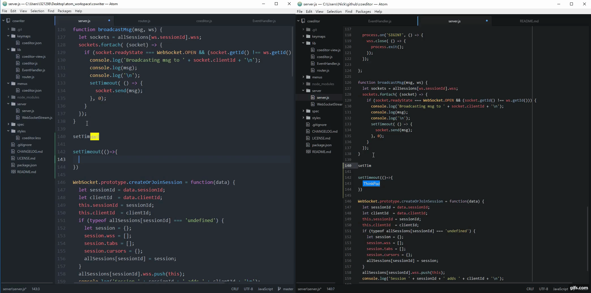

# Coeditor

Yet Another Pair Programming Package for Atom.

## Demo
_Click to view high quality video on YouTube_

## Usage
This package requires a server to forward changes to each clients.
Currently there is no available common server yet, but it is quite simple to deploy one by your own.

_prerequisite: node.js (v>=6.10.1)_

+ Clone this repo
  - `git clone https://github.com/nicktogo/coeditor.git`  
+ Install dependencies
  - `cd coeditor`
  - `npm install`
+ Start Server
  - `npm start`
  - By default, the server will listen on port 9090
+ Toggle package in Atom
  - ~~open `coeditor` folder in Atom~~
  - ~~change `address` in `coeditor.js` and save~~
  - ~~client can now set server address when toggling package~~
  - ~~link package to Atom~~
    - ~~`cd coeditor`~~
    - ~~`apm link`~~
  - ~~reload Atom, `ctrl + shift + F5`~~
  - install coeditor via Atom
  - modify settings in the package's settings view firstly
    - server address (with port)
    - client id which will show in indicator
    - indicator background color
    - line ending
  - open project folder in Atom
  - toggle coeditor, `ctrl + shift + p` then type `toggle`, hit `coeditor: toggle`
  - input ~~server address,~~ session id ~~and client id~~
  - check your server console
  - disconnect, `ctrl + shift + p` then type `disconnect`, hit `coeditor: disconnect`

## Features
+ Non-conflict collaborative text editing
+ Text highlight synchronization
+ Collaborative awareness
+ Project sync
+ File grammar sync
+ Active tab sync
+ Project's files saving and closing sync

## Known issue
+ If clients use different types for line ending (i.e. CRLF or LF) with each other, this package will cause files end up with inconsistent content.
**MAKE SURE ALL CLIENTS USE THE SAME TYPE FOR LINE ENDING AND SET TYPE IN PACKAGE'S SETTING VIEW! (EITHER CRLF OR LF WILL DO)**

## TODO
+ ~~Customized configuration (Server address, random session id or given by user)~~ DONE
+ ~~Broadcast disconnections to other living Atom clients~~ DONE
+ ~~Check socket status before using~~ DONE
+ ~~Broadcast server close to each Atom clients, and disconnect all clients~~ DONE
+ ~~Text selection background and cursor colors for different Atom clients ?~~ DONE  
+ Suggestions Synchronization NO API
+ ~~Settings view~~ DONE
+ ~~Working folder files synchronization~~ DONE
+ ~~File operations synchronization~~ DONE
  - ~~save -- DONE, but limited, don't work for new file which does not have path~~
  - ~~close~~
+ ~~Tab sync~~
+ Heartbeat between client and server
+ Build cloud server
+ Write spec

## Tentative
+ ~~Working folder files synchronization~~ MOVED TO TODO list
+ Server uses in-memory storage when running, so no file content will be stored in server when it is shutdown, might change to MongoDB

## Thanks
+ Dr. Fan Hongfei
+ [ShareDB](https://github.com/share/sharedb)
+ [ws](https://github.com/websockets/ws)
